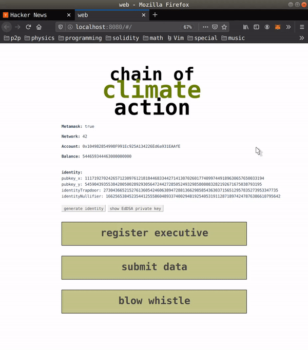

# UI for datawhistleblowing
- please find full write-up at https://github.com/openclimate-sg/whitepaper/wiki
- please find smart contracts and zk-SNARK circuits at https://github.com/openclimate-sg/datawhistleblowing

## Overview
For the purposes of this hackathon, we have implemented a simple proof of concept. We use as an example a solar energy farm which is required to report its daily power production. We also assume that this farm is a corporation with 5 executives.

Each executive registers their cryptographic identity into an Ethereum smart contract (based on Semaphore (https://weijiekoh.github.io/semaphore-ui/, https://github.com/kobigurk/semaphore/), a zero-knowledge signalling gadget), so that anyone can anonymously prove their membership in the set and broadcast a whistleblowing signal.



We then simulate the following process of the company reporting data, along with a deposit, for five days in a row, and an executive anonymously blowing the whistle on data reported on the fifth day. This locks up part of the total deposit. After an investigation (outside the system), an investigator then seizes part of the total amount deposited, and rewards part of the seized funds to a separate address specified by the whistleblower when she blew the whistle earlier.

## Demo
1. On day 1, the solar farm publishes their true power readings on a smart contract and deposits 0.1 ETH along with the data.
2. The solar farm does the same for days 2, 3, and 4.
3. On day 5, however, the solar farm reports false power readings.
4. Alice, an executive in the corporation, decides to blow the whistle on this false reading. She produces a zero-knowledge proof of her membership in the set of executives, states that the readings of day 5 are fraudulent, and publishes it. Most importantly, the proof does not reveal Alice’s identity.
5. The smart contract locks up 0.2 ETH of deposits pending the results of an external investigation.
6. We assume that the investigator is a trusted third party. They hold the administrative private key with which they can unlock the farm’s deposit, or trigger the confiscation of said funds. Alice is rewarded a portion of the deposit for correctly whistleblowing, with this portion determined by the rules agreed upon, and saved in the smart contract. In this demo, she is rewarded 0.1 ETH. For the sake of anonymity, we assume that her payout address, specified along with the zero-knowledge proof, is unlinked to the address used to register her identity.


## Build Setup
Things to note:
- remember to turn off privacy mode in Metamask!
- clone submodules using `git submodule update --init --recursive`

``` bash
# install dependencies
npm install

# serve with hot reload at localhost:8080
npm run dev

# build for production with minification
npm run build

# build for production and view the bundle analyzer report
npm run build --report

```
